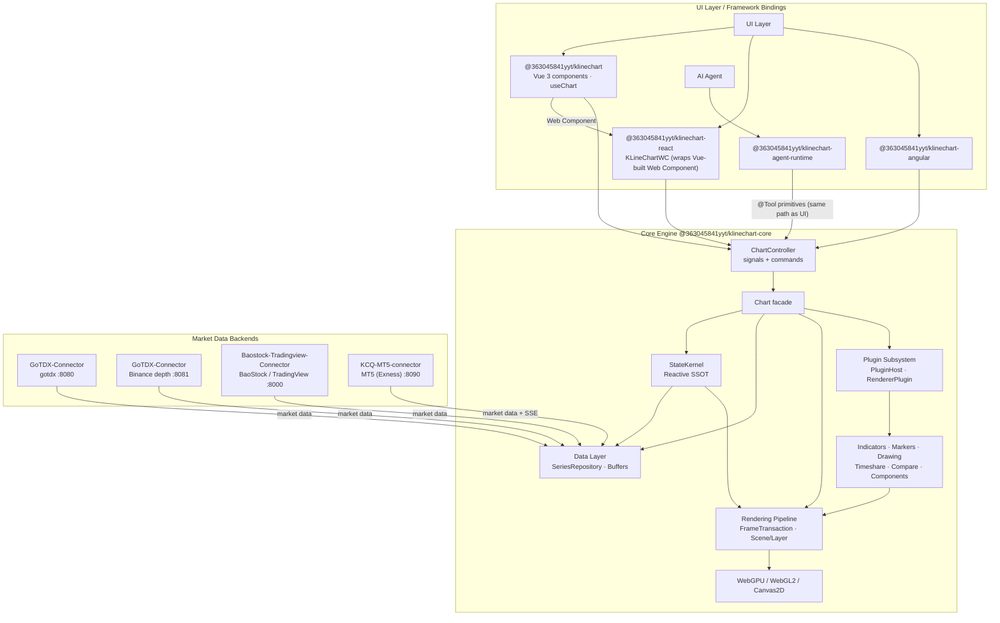

High-performance financial chart library with a single-frame generation time of just 2ms, stable scrolling at 190–200fps in a 200Hz environment, native support for AI Agent control, full-link ResizeObserver-driven crisp rendering, and a pluggable architecture.


<div align="center">

English | [简体中文](README_CN.md)

# 📈 KLineChartQuant

**Crisp Rendering · High Performance · Optimized Interaction · Mobile-Friendly**

[](https://www.npmjs.com/package/@363045841yyt/klinechart) [](https://www.npmjs.com/package/@363045841yyt/klinechart) [](https://github.com/363045841/klinechart/blob/main/LICENSE) [](https://363045841.github.io/KLineChartQuant/)

[](https://qm.qq.com/q/672011965) [](https://t.me/+1o-6B-wVRTU2MjQ9)

</div>

---


A lightweight financial K-line charting library focused on quantitative trading scenarios. **Agent is a first-class citizen** — supports AI Agent direct control of chart operations, providing TradingView-level interaction experience.

<div align="center">
  
  
  <br/>
  
  
  <br/>
  
  
</div>


## 🔀 NexusAI Fork

This repository is **KCQ-NexusAI**, a public fork of [KLineChartQuant](https://github.com/363045841/KLineChartQuant) maintained by [EliteOtaku](https://github.com/EliteOtaku). All credit for the charting engine goes to the upstream author — this fork only adds:

- **NexusAI Shell** (`packages/nexus-shell`): a generic, business-decoupled TradingView-style host shell (React + Vite). Top bar / drawing toolbar / indicator panel / template system skeleton / theme tokens. MIT, free to reuse.
- **Engine enhancements** accumulated on `nexus/main` and offered back upstream in small, focused batches (`pr/*` branches): builtin data-source registration for the web component, `4h` period, drawing selection timing fix, TV-style drawing templates.

Branch model: `main` mirrors upstream (fast-forward only); `nexus/main` is the fork integration line. See [NOTICE](./NOTICE) for attribution details.


## 🤖 Agent-Native Architecture

KLineChartQuant treats the Agent as a first-class citizen of the chart, equal in standing to the human user. It is not a chat layer bolted on top: the Agent operates the chart through the same primitives as the UI, and the endpoints it acts on are exposed by the chart core itself.

- **The Agent is the user, and the user is the Agent**: The Agent is not a guest of the chart; it is an operator with the same standing as the person in front of the screen. Everything a user can do through the UI, the Agent can do through the same entry points, and vice versa. Equality of access is the design premise, not a toggle.

- **The Agent serves the chart, not a stream of text**: An embedded Agent exists to drive the chart the user is looking at, not to bury them in prose. Its output lands as real interaction on the surface the user sees—indicators, drawings, viewport changes—with conversation only as the means. The chart and its interaction remain the subject.

- **AI-Native architecture, not a parasitic layer**: Tools are woven into the chart API primitives as aspects rather than wrapped in a separate layer, so there is one implementation, naturally consistent state, and zero bridge overhead. Zed is the reference: its agent is built into the editor's own foundation (GPUI). VS Code is the counter-example: Copilot and Claude Code enter through the extension layer, where the Claude extension is essentially a GUI wrapper around an external CLI. The former makes the Agent native; the latter makes it parasitic.

- **The Agent pushes the architecture toward stability and efficiency**: Adding an Agent adds no architectural burden; it forces the architecture to be better. Because every capability must be exposed through a single API and unified primitives, state is consolidated into one source of truth and kept absolutely consistent—scattered state, derived copies, multi-write paths, parallel pipelines, and races cannot survive. The Agent and the user travel the same path, and that constraint settles into a more stable, testable chart core.

- **No blind use of MCP**: The project evolved through three stages—an early JSON-configuration approach, then MCP, and finally an AI-Native architecture. MCP demands an intermediate layer or DSL that spends tokens, loses information, and keeps a second copy of state that invades frontend logic. The current design drops the bridge entirely: tools register directly on the chart core, and a single call reaches the kernel.

- **The reactive kernel is the Agent's foundation**: StateKernel is the single source of truth—only actions may write, computed values derive automatically, and external consumers receive readonly signals, backed by batched atomic snapshots and frozen state. The kernel is zero-dependency, extremely light, and has controllable render timing. This lets the Agent share the user's exact state at near-zero cost and keeps tools a subset of actions rather than a parallel system.


## ✨ Core Features

- **Agent Native** - The chart core exposes its capabilities as `@Tool`-decorated domain primitives, and the Agent calls the same primitives as the UI. Tools are a subset of actions: one shared state, one execution path, no bridge layer
- **Crisp Rendering** - Full-chain ResizeObserver driven, physical pixel alignment, K-lines, wicks, and lines are sharp and clear on all DPR screens
- **Plugin Architecture** - Renderer plugin-based design, supporting dynamic registration, configuration, and lifecycle management
- **Custom Markers** - Supports semantic configuration of custom markers and custom information
- **High Performance** - Smoothly handles tens of thousands of data points, no lag during zoom or pan; supports **190-200fps on 200Hz displays** with single-frame generation time as low as **2ms**
- **Multi-Backend Rendering** - Submit drawing primitives once, render via **WebGPU**, **WebGL**, or **Canvas2D**. WebGPU provides hybrid DOM canvas (no `compositeTo` copy), single-command-buffer-per-frame submission with 4x MSAA, and per-instance geometry caching via ResourceTable. Automatic fallback chain: WebGPU → WebGL → Canvas2D. Reaching **190fps on 200Hz displays** with per-frame GPU time under **1ms**
- **Optimized Interaction** - Stable zoom anchor, precise crosshair cursor, smooth drag
- **Mobile-Optimized Interaction** - Long-press crosshair for data exploration, tap to dismiss, slide to browse data without triggering chart scroll, gesture-based scroll mode
- **Multi-Symbol Comparison** - Supports unlimited number of instruments for trend comparison
- **Multi-Source Aggregation** - Supports aggregation and unification of multiple data sources
- **Batch Data Export** - Select a date range and export multiple stocks' K-line data into a single CSV file, with progress indication
- **Custom Tooltip** - Fully customizable tooltip via named slots (`#kline-tooltip`, `#marker-tooltip`), with engine-provided hover data, position, and styling


## 📐 System Architecture

KLineChartQuant is a pnpm monorepo. The framework-agnostic core engine exposes a unified
`ChartController` (readonly signals + commands); Vue / React / Angular bindings only handle
mounting, event forwarding, and reactivity bridging. The AI Agent drives the chart through the
same `@Tool` primitives as the UI, sharing one state source instead of a bridge.



- **Core engine** — headless chart engine + `ChartController`; depends on no UI framework.
- **StateKernel** — single source of truth: readonly signals for reads, actions for writes,
  `computed()` for derivation, `effect()` for DOM side effects.
- **Rendering** — submit primitives once, render via WebGPU / WebGL2 / Canvas2D with
  automatic fallback (WebGPU → WebGL → Canvas2D).
- **Data layer** — unified `SeriesRepository` + incremental buffers + fetch scheduler;
  multi-source aggregation (gotdx / BaoStock / TradingView / MT5 / mock) and Binance depth.
- **Plugin subsystem** — PluginHost / HookSystem / EventBus / RendererPluginManager;
  indicators, markers and drawing tools plug in as Scene Layers.
- **React via Web Component** — `@363045841yyt/klinechart-react`'s `KLineChartWC` renders the
  `<kline-chart>` Custom Element bundled from the Vue package (`@363045841yyt/klinechart/web-component`).
- **Agent Native** — `@363045841yyt/klinechart-agent-runtime` orchestrates the Agent, which
  invokes the core's `@Tool`-registered primitives—the same entry points the UI uses.

See [docs/architecture.md](docs/architecture.md) for the full architecture document.


## ⚡ Performance

KLineChartQuant ships a self-developed rendering engine that submits drawing primitives directly to Canvas, WebGL, or WebGPU, so a single codebase can switch rendering backends seamlessly. The numbers below come from the reproducible benchmark in [`bench/`](bench/README.md) (`node bench/run.mjs`). Default setup: headless Chrome, 1180 × 640 viewport, DPR 2, 4× MSAA, 120 warm-up frames + 600 sampled frames. FPS is `requestAnimationFrame`-observed and capped by the display refresh rate (200 Hz here); Canvas2D has no page-level GPU timer, so its GPU time is empty. Hardware: NVIDIA GeForce RTX 4060 Laptop GPU (driver 616.92) with headless Chrome 153, forced to the discrete GPU.

### WebGPU Command Submission

Seven command buffers submitted as one batched `queue.submit` versus seven separate submissions:

| Submission | P50 (ms) |
| --- | --- |
| One `queue.submit` (batched) | 0.002 |
| Seven `queue.submit` (split) | 0.011 |
| Speedup | **5.50×** |

### MA5 / MA20 / MA60 (Simple Indicator)

| Visible K-lines | Backend | Prepare P50 (ms) | CPU Submit P50 (ms) | GPU P50 (ms) | FPS | 1% Low | Frame P99 (ms) | Jank |
| --- | --- | --- | --- | --- | --- | --- | --- | --- |
| 1,000 | Canvas2D | 0.200 | 0.300 | N/A | 200.0 | 192.3 | 5.20 | 0.00% |
| 1,000 | WebGL2 | 0.300 | 0.900 | 0.277 | 199.3 | 192.3 | 5.20 | 0.33% |
| 1,000 | WebGPU | 0.300 | 0.300 | 0.017 | 200.0 | 192.3 | 5.20 | 0.00% |
| 5,000 | Canvas2D | 0.600 | 1.100 | N/A | 102.2 | 66.2 | 15.10 | 25.83% |
| 5,000 | WebGL2 | 0.900 | 1.800 | 0.324 | 199.7 | 192.3 | 5.20 | 0.00% |
| 5,000 | WebGPU | 1.100 | 0.400 | 0.044 | 200.0 | 192.3 | 5.20 | 0.00% |
| 10,000 | Canvas2D | 1.100 | 2.000 | N/A | 97.2 | 65.4 | 15.30 | 32.33% |
| 10,000 | WebGL2 | 1.200 | 2.100 | 0.496 | 198.0 | 190.5 | 5.25 | 0.33% |
| 10,000 | WebGPU | 1.900 | 0.500 | 0.017 | 197.4 | 190.6 | 5.25 | 0.50% |

### Ichimoku (Complex Rendering Workload)

| Visible K-lines | Backend | Prepare P50 (ms) | CPU Submit P50 (ms) | GPU P50 (ms) | FPS | 1% Low | Frame P99 (ms) | Jank |
| --- | --- | --- | --- | --- | --- | --- | --- | --- |
| 1,000 | Canvas2D | 0.700 | 0.400 | N/A | 164.4 | 98.0 | 10.20 | 6.50% |
| 1,000 | WebGL2 | 1.700 | 0.800 | 0.308 | 200.0 | 192.3 | 5.20 | 0.00% |
| 1,000 | WebGPU | 1.900 | 0.300 | 0.042 | 200.0 | 192.3 | 5.20 | 0.00% |
| 5,000 | Canvas2D | 3.500 | 1.700 | N/A | 66.2 | 49.5 | 20.20 | 97.17% |
| 5,000 | WebGL2 | 3.400 | 1.600 | 0.294 | 182.1 | 99.0 | 10.10 | 3.83% |
| 5,000 | WebGPU | 3.500 | 0.300 | 0.084 | 198.0 | 188.7 | 5.30 | 0.50% |
| 10,000 | Canvas2D | 6.800 | 3.100 | N/A | 60.3 | 49.0 | 20.40 | 100.00% |
| 10,000 | WebGL2 | 6.800 | 3.300 | 1.968 | 89.3 | 65.8 | 15.20 | 46.00% |
| 10,000 | WebGPU | 6.800 | 0.600 | 0.095 | 123.5 | 67.1 | 14.90 | 17.33% |

> **Note**: The frame drops (jank) in the Ichimoku case are not caused by the rendering engine — they stem from a CPU-side bottleneck, which will be optimized in a future release.


## 📡 Data Sources

KLineChart requires a market data backend. Supported data sources:

| Data Source | Description | Docs |
|---|---|---|
| `gotdx` | Tongdaxin (GOTDX) quotes: A-share / futures / MAC, served by `GoTDX-Connector` | [GoTDX-Connector](docs/data-sources/klinechartquantgo.zh-CN.md) |
| `baostock` | BaoStock A-share daily / weekly / monthly & minute K-lines, served by `Baostock-Tradingview-Connector` | [BaoStock](docs/data-sources/baostock.zh-CN.md) |
| `tradingview` | TradingView global instruments, served by `Baostock-Tradingview-Connector` | [BaoStock](docs/data-sources/baostock.zh-CN.md) |
| `mt5` | MT5 (Exness) local terminal: forex / metals / crypto CFDs, served by `KCQ-MT5-connector` | [MT5](docs/data-sources/mt5.zh-CN.md) |
| `mock` | Debug only: local MOCK-100 / MOCK-10000 K-lines, no backend needed, always online | — |

Backend repos live alongside this one (outside the monorepo).

### One-Command Dev Startup

Clone the data-source backends first (idempotent: skips directories that already exist):

```bash
pnpm setup:backends
```

Then run `pnpm dev` with a `-c` argument to start the frontend and the selected connectors together:

```bash
pnpm dev                      # frontend only (Vite dev server)
pnpm dev -c all               # frontend + all backends (gotdx + binance + baostock; mt5 excluded)
pnpm dev -c gotdx baostock    # frontend + selected backends
pnpm dev -c mt5               # frontend + MT5 local terminal (Windows + logged-in MT5 terminal)
pnpm dev -c tdx               # aliases supported (tdx / g / b / bnb / m / all)
pnpm dev -c all --lan         # same, dev server bound to 0.0.0.0 (LAN accessible)
```

Common shorthands:

```bash
pnpm dev:all                  # frontend + all backends
pnpm dev:g                    # frontend + gotdx (Tongdaxin)
pnpm dev:b                    # frontend + BaoStock / TradingView
pnpm dev:bnb                  # frontend + Binance depth
pnpm dev:mt5                  # frontend + MT5 local terminal
pnpm dev:lan:all              # frontend (0.0.0.0) + all backends
```

Parallel process logs stay in one terminal and are separated by colored source prefixes: `[vite]`, `[gotdx]`, `[binance]`, `[baostock]`, and `[mt5]`.

In Windows PowerShell, run `node scripts/dev.mjs -c gotdx` (or use the other `-c` arguments above) to finish shutdown logs before the next prompt after Ctrl+C. `pnpm dev` adds a pnpm process that also receives Ctrl+C; the child script cannot control when pnpm prints `[ELIFECYCLE]`.

Backend only (no frontend):

```bash
pnpm connector                # all backends (mt5 excluded)
pnpm connector gotdx          # gotdx (Tongdaxin) :8080
pnpm connector baostock       # BaoStock / TradingView :8000
pnpm connector mt5            # MT5 local terminal :8090 (Windows + logged-in MT5 terminal)
```

For backend only with the same shutdown ordering, run `node scripts/start-connector.mjs gotdx`.

After `pnpm setup:backends`, no extra setup is needed. The dev server proxies `/api/stock` → `:8000` (Baostock-Tradingview-Connector) and `/api/public` → `:8080` (GoTDX-Connector).


## 🚀 Quick Start

### 3. Install and Use

```bash
npm install @363045841yyt/klinechart @363045841yyt/klinechart-core
```

**Use the component:**

```vue
<template>
  <div class="app-container" :data-theme="currentTheme">
    <KlineChart v-model:theme="currentTheme" :custom-data="customData" :settings="chartSettings" />
  </div>
</template>

<script setup lang="ts">
  import { ref } from 'vue'
  import type { ChartSettings } from '@363045841yyt/klinechart-core'
  import { type CustomDataSource, KlineChart } from '@363045841yyt/klinechart'
  import demoData from './demo-data.json'

  const currentTheme = ref<'light' | 'dark'>('dark')

  const customData = ref<CustomDataSource>(demoData as CustomDataSource)

  const chartSettings: ChartSettings = {
    showGridLines: true,
    isAsiaMarket: true,
    showVolumePriceMarkers: false,
    mainLeftAxisDisplaySetting: 'none',
    theme: 'dark',
    colorPresetSettings: {
      dark: {
        candleUpBody: '#e85d04',
        candleDownBody: '#1b4332',
        crosshairLine: '#faa307',
        gridMajor: '#3e2723',
      },
    },
  }
</script>

<style>
  .app-container {
    display: flex;
    flex-direction: column;
    height: 80vh;
  }

  .app-container[data-theme='dark'] {
    background: #000;
    color: #e5e7eb;
  }
</style>
```

**Import CSS in main.ts:**

```typescript
import '@363045841yyt/klinechart/style.css'
import { createApp } from 'vue'
import App from './App.vue'

createApp(App).mount('#app')
```

**Slot Usage — Custom Tooltip:**

```html
<KlineChart>
  <template #kline-tooltip="{ hoverData, upColor, downColor }">
    <div class="custom-tooltip">
      <div class="custom-tooltip__title">
        <span>{{ hoverData.stockCode }}</span>
        <span>{{ formatTimestamp(hoverData.timestamp, { timeZone: 'Asia/Shanghai' }) }}</span>
      </div>
      <div
        class="custom-tooltip__price"
        :style="{ color: hoverData.close >= hoverData.open ? upColor : downColor }"
      >
        {{ hoverData.close.toFixed(2) }}
      </div>
      <div class="custom-tooltip__detail">
        O: {{ hoverData.open.toFixed(2) }}<br />
        H: {{ hoverData.high.toFixed(2) }}<br />
        L: {{ hoverData.low.toFixed(2) }}<br />
        C: {{ hoverData.close.toFixed(2) }}
      </div>
    </div>
  </template>
</KlineChart>
```

**Slot Usage — Custom Main-Pane Legend:**

Providing `#legend` fully replaces the default Canvas legend. The slot scope is the full `LegendTemplateContext` (OHLC, timeshare, main indicators, comparisons, layout, colors).

```vue
<template #legend="{ index, currentBar, timeshare, indicators, comparisons, colors }">
  <div class="my-legend">
    <!-- Custom fields added to KLineData[] for PR #98 are exposed through currentBar -->
    <div v-if="currentBar" class="my-legend__row">
      <span :style="{ color: currentBar.color }">
        开盘 {{ currentBar.open.toFixed(2) }} 最高 {{ currentBar.high.toFixed(2) }} 最低
        {{ currentBar.low.toFixed(2) }} 收盘 {{ currentBar.close.toFixed(2) }}
      </span>
      <span v-if="currentBar.volumeText"> Vol {{ currentBar.volumeText }}</span>
    </div>

    <div v-if="timeshare" class="my-legend__row">
      <span :style="{ color: timeshare.changeColor }">
        现价 {{ timeshare.price.toFixed(2) }} 涨幅 {{ timeshare.changePercent.toFixed(2) }}%
      </span>
    </div>

    <!-- Using main chart indicator legend data -->
    <div v-for="indicator in indicators" :key="indicator.name" class="my-legend__row">
      <span>{{ indicator.name }}:</span>
      <template v-for="value in indicator.values" :key="value.label">
        <span :style="{ color: value.color }">
          {{ value.label }} {{ value.value.toFixed(3) }}
        </span>
      </template>
    </div>
    <!-- Using comparison commodity data -->
    <div
      v-for="comparison in comparisons"
      :key="comparison.symbol"
      class="my-legend__row"
      :style="{ color: comparison.percentColor }"
    >
      {{ comparison.symbol }}
      {{ comparison.percent > 0 ? '+' : '' }}{{ comparison.percent.toFixed(2) }}%
    </div>
  </div>
</template>
```


### 4. (Optional) Add AI Agent Control

The chart core exposes its domain capabilities as `@Tool` primitives. Both the UI and the Agent call them through the same path:

```ts
import { getRegisteredChartTools } from '@363045841yyt/klinechart-core/controllers'
```

`getRegisteredChartTools()` returns every tool with its parameter schema, safety level, and unified executor. Hand them to `@363045841yyt/klinechart-agent-runtime`, which orchestrates the Agent inside your app (browser or Electron) against a Provider profile — no MCP bridge, no side-channel state. See [agent-runtime](packages/agent-runtime/README.md).


## 📖 More Documentation

- [Rendering Pipeline](docs/rendering-pipeline.md) - Current paint path: FrameTransaction, Scene/Layer, Renderer backends


## 📋 Component Props

| Prop | Type | Default | Description |
|------|------|---------|-------------|
| theme | `'light' \| 'dark'` | — | Chart theme. Use `v-model:theme` for two-way binding |
| isFullscreen | `boolean` | — | Controlled fullscreen state. Leave unbound for internal (non-controlled) mode |
| timezone | `string` | `'Asia/Shanghai'` | Time zone for date/time display |
| yPaddingPx | `number` | 20 | Y-axis padding in pixels |
| minKWidth | `number` | 1 | Minimum K-line width (logical pixels) |
| maxKWidth | `number` | 50 | Maximum K-line width (logical pixels) |
| rightAxisWidth | `number` | 0 | Right price axis width |
| leftAxisWidth | `number` | 0 | Left price axis width (0 = hidden) |
| bottomAxisHeight | `number` | 24 | Bottom time axis height |
| priceLabelWidth | `number` | 60 | Price label extra width for showing change percentage |
| zoomLevels | `number` | 20 | Total number of zoom levels |
| initialZoomLevel | `number` | 3 | Initial zoom level (1 ~ zoomLevels) |
| customData | `CustomDataSource` | — | Inline data bundle: `{ symbol?, period?, data, comparisons? }`. Bypasses the fetcher pipeline entirely. See example above |
| teleportContainer | `string \| HTMLElement` | — | Teleport target for dropdowns/modals (CSS selector or element). Defaults to internal `.chart-wrapper` |


## 🗺️ Roadmap

- [x] v0.10: AI-native chart support
- [x] K-line zoom anchor stability, improved zoom feel
- [x] Right axis detached from scroll container, completely solving clipping issues
- [x] Blank area drawing support
- [x] Limit vertical pan range to prevent viewport from leaving data
- [x] Drawing system
- [x] Right axis zoom
- [x] Latest price line and right axis label style optimization
- [x] Area primitive tools and rendering
- [x] More advanced drawing tools
- [x] Support for minute, multi-day, monthly, and yearly K-line display
- [ ] Support convert the drawing to quant code


## 📦 Packages

| Package | Description | npm |
|---------|-------------|-----|
| `@363045841yyt/klinechart-core` | Headless chart engine + controllers | [npm](https://www.npmjs.com/package/@363045841yyt/klinechart-core) |
| `@363045841yyt/klinechart` | Vue 3 bindings | [npm](https://www.npmjs.com/package/@363045841yyt/klinechart) |
| `@363045841yyt/klinechart-react` | React bindings | [npm](https://www.npmjs.com/package/@363045841yyt/klinechart-react) |
| `@363045841yyt/klinechart-angular` | Angular bindings | [npm](https://www.npmjs.com/package/@363045841yyt/klinechart-angular) |
| `@363045841yyt/klinechart-agent-runtime` | Framework-neutral Agent runtime (Pi orchestration + host contracts) | [npm](https://www.npmjs.com/package/@363045841yyt/klinechart-agent-runtime) |


## 🚀 What's New

- **v0.11** Introduced the AI Agent runtime (agent-runtime and AI runtime with OpenAI protocol support and a shared web/Electron Agent workspace) plus `@tool` registration and drawing Agent tools. Drawing gained sub-pane and timeshare support with workspace isolation, multi-select and batch editing, blank-area anchors, inline text editing, marquee group drag, and configurable labels; five-day timeshare, native timeshare indicators, and persistent view workspaces landed alongside WebGL-on-visible-canvas rendering.
- **v0.10** Reworked the data layer around a unified MarketDataProvider, added multi-day timeshare, a unified indicator query pipeline shared by charts and Agents, Fibonacci/rectangle/arrow annotation tools, and promoted comparison to a first-class chart mode. Aligned the Vue/React/Angular bindings with the unified provider contract and shipped multiple rendering and state-consistency fixes.
- **v0.9.0** Self-developed Core-layer reactive state model migration, timing issues eliminated
- **v0.9.0** Single-path Scene renderer + WebGPU backend (hybrid DOM canvas, no compositeTo), FrameTransaction reactivity, device-lost recovery, auto-fallback WebGPU → WebGL → Canvas2D
- **v0.8** Symbol comparison, multi-source data aggregation
- **v0.7** Renderer registration chain AOP refactoring with decorator syntax, monorepo split, Vue/React bindings (experimental), standalone core package, tokenized color system
- **v0.6.10** Unified WebGL rendering context sharing for all panes, plus sub-pane lifecycle refactoring — centralized pane instance management via SubPaneManager with first-class paneId identity
- **v0.6.6** Comprehensive rendering optimizations: batched price-to-Y calculations, cached tick positions and geometry, optimized month-key operations; achieves stable **190-200fps on 200Hz displays** with frame generation time down to **2ms**
- **v0.6.3** WebGL rendering for K-lines, volume bars, and MACD bars; significant performance boost across the board
- **v0.6.1** Dual-layer canvas architecture: Main + Overlay separation with UpdateLevel filtering, achieves stable **180fps with low jitter on 200Hz displays**
- **v0.6.0** Stateless indicator pipeline: MA/BOLL/EXPMA/ENE/RSI/CCI/STOCH/MOM/WMSR/KST/FASTK now use unified Calculator → Scheduler → StateStore → Renderer architecture for better performance and maintainability
- **v0.5.6** Logarithmic price axis with evenly distributed grid lines at pixel level
- **v0.5.2** Advanced drawing tools: parallel channel, regression channel, smooth top/bottom, and non-intersecting channel
- **v0.5.0** Complete drawing tool system, supporting line, rectangle, text drawing and style editing
- **v0.4** Modern UI, left toolbar, right axis optimization, TradingView-style zoom feel


## 📄 License

[MIT](LICENSE)

