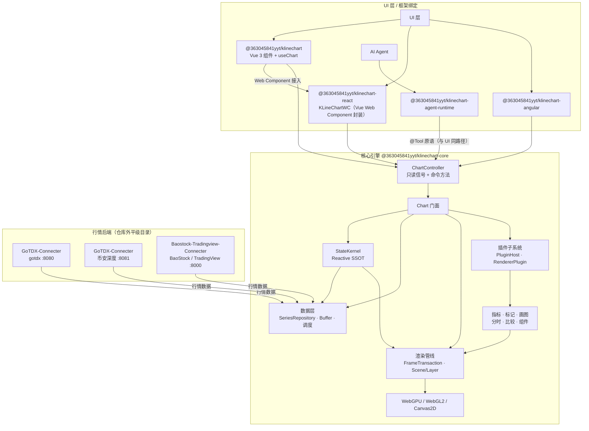

高性能金融图表库，单帧生成时间仅需2ms，200hz环境下稳定滚动190-200fps，原生支持 AI Agent 控制，全链路 ResizeObserver 驱动清晰渲染，插件化架构。


<div align="center">

[English](README.md) | 简体中文

# 📈 KLineChartQuant

**渲染清晰 · 高性能 · 交互优化 · 移动端友好**

[](https://www.npmjs.com/package/@363045841yyt/klinechart) [](https://www.npmjs.com/package/@363045841yyt/klinechart) [](https://github.com/363045841/klinechart/blob/main/LICENSE) [](https://363045841.github.io/KLineChartQuant/)

[](https://qm.qq.com/q/672011965) [](https://t.me/+1o-6B-wVRTU2MjQ9)

</div>

---


轻量级金融 K 线图表库，专注量化交易场景。**Agent 是一等公民** — 支持 AI Agent 直接控制图表操作，提供 TradingView 级别的交互体验。

<div align="center">
  
  
  <br/>
  
  
  <br/>
  
  
</div>


## 🔀 NexusAI Fork 说明

本仓库是 **KCQ-NexusAI**——由 [EliteOtaku](https://github.com/EliteOtaku) 维护的 [KLineChartQuant](https://github.com/363045841/KLineChartQuant) 公开 fork。图表引擎的全部功劳归上游作者，本 fork 只在其上增加：

- **NexusAI Shell**（`packages/nexus-shell`）：通用、与业务解耦的 TradingView 风格宿主壳（React + Vite）——顶栏 / 绘图工具条 / 指标管理面板 / 模板系统骨架 / 主题 token。MIT 随上游沿承，欢迎复用壳层。
- **引擎通用增强**：积累在 `nexus/main` 集成线，按小而聚焦的批次（`pr/*` 分支）回馈上游：Web Component 内置数据源注册、`4h` 周期、画完保持选中时序修复、TV 式绘图模板。

分支模型：`main` 只做 upstream 镜像（fast-forward）；`nexus/main` 为 fork 集成线。署名细节见 [NOTICE](./NOTICE)。


## 🤖 Agent 原生架构

KLineChartQuant 将 Agent 视为图表的一等公民，与用户等权。它不是附着的对话层，而是与 UI 共用同一套原语操作图表，操作端点由图表核心主动对外暴露。

- **Agent 即用户，用户即 Agent**：Agent 不是图表的外来访客，而是与屏幕前的人同权的操作者。用户在 UI 上能做的一切，Agent 都能通过相同入口完成，反之亦然。等权是架构前提，不是可开关的功能。

- **Agent 服务图表，而非输出文字流**：内嵌 Agent 的意义在于操作用户眼前的图表，而不是用大段文字淹没用户。它的输出落在用户所见界面上——指标、绘图、视口变化——对话只是手段，图表与真实交互始终是主体。

- **AI-Native 原生架构，而非寄生层**：工具以切面方式织入图表 API 原语，而非包成独立一层，因此一份逻辑、状态天然一致、调用零开销。Zed 是原生范本：Agent 构建在编辑器自身地基（GPUI）之上；VS Code 是寄生反例：Copilot 与 Claude Code 经扩展层接入，Claude 扩展本质是外部 CLI 的 GUI 包装。前者让 Agent 原生，后者让 Agent 寄生。

- **Agent 反向推动架构稳定与高效**：引入 Agent 不增加架构负担，反而倒逼架构更好。因为每种能力都必须由统一 API 与统一原语暴露，状态必须内收为 SSOT 并保持绝对一致，状态散落、副本转态、多处写入、并行链路与竞态都无法存续。Agent 与用户走同一条链路，这份约束最终沉淀为更稳定、可测试的图表核心。

- **不盲目使用 MCP**：项目经历三个阶段——早期 JSON 配置式、随后 MCP、最终走向 AI-Native 原生架构。MCP 需要中间层或 DSL，浪费 token、丢失信息，且桥接层自身维护状态副本、侵入前端逻辑。现方案取消桥接：工具直接注册在图表核心上，一次调用即进内核。

- **响应式内核是 Agent 的地基**：StateKernel 是唯一真源——只有 action 能写，computed 自动链式推导，外部只拿 readonly signal，并配合 batch 原子快照与深拷贝冻结。内核零依赖、极致轻量、渲染时机可控，这让 Agent 能以近零开销共享用户的准确状态，也让工具成为 Action 的子集，而非另一套并行系统。


## ✨ 核心特性

- **Agent 原生** - 图表核心以 `@Tool` 装饰的领域原语对外暴露能力，Agent 与 UI 调用同一套原语。工具是 Action 的子集：共享同一状态、同一条执行链路，无桥接层
- **渲染清晰** - 全链路 ResizeObserver 驱动，物理像素对齐，各 DPR 屏幕下 K 线、影线、线条均锐利清晰
- **插件架构** - 渲染器插件化设计，支持动态注册、配置和生命周期管理
- **自定义标记** - 支持语义化配置自定义标记和自定义信息
- **高性能** - 流畅处理万级数据点，无卡顿缩放平移；**200Hz 屏幕下支持 190-200fps**，单帧生成时间低至 **2ms**
- **多后端渲染** - 统一绘制原语一次提交，支持 **WebGPU**、**WebGL**、**Canvas2D** 三种后端。WebGPU 提供混合 DOM Canvas（无 `compositeTo` 拷贝）、单命令缓冲每帧提交、原生 4x MSAA、基于 ResourceTable 的实例几何缓存。自动降级链路：WebGPU → WebGL → Canvas2D。**200Hz 屏幕下可达 190fps**，每帧 GPU 耗时 **<1ms**
- **交互优化** - 缩放锚点稳定、十字光标精准、拖拽流畅
- **移动端交互优化** - 长按十字线浏览数据不触发滚动，拖拽移动十字线，轻点取消，再次触摸手势滚动
- **商品比较** - 支持无限数量商品走势比较
- **多数据源** - 支持多数据源聚合并可自由扩展
- **批量数据导出** - 选择时间范围后，批量输入多个股票代码，一键导出合并 CSV 文件，支持进度提示
- **自定义 Tooltip** - 通过命名插槽（`#kline-tooltip`、`#marker-tooltip`）完全自定义 tooltip，引擎提供悬停数据、位置和样式


## 📐 系统架构

KLineChartQuant 是一个 pnpm monorepo。核心引擎不依赖任何 UI 框架，通过统一的
`ChartController`（只读信号 + 命令方法）对外暴露能力；Vue / React / Angular 绑定层只负责
挂载、事件转发与响应式桥接。AI Agent 通过与 UI 相同的 `@Tool` 原语直接驱动图表，
共享同一状态源，而非桥接层。



- **核心引擎** — 无头图表引擎 + `ChartController`，不依赖任何 UI 框架。
- **StateKernel** — 状态单一事实源：只读信号读、action 写、`computed()` 派生、
  `effect()` 副作用。
- **渲染** — 图元一次提交，WebGPU / WebGL2 / Canvas2D 三后端渲染，自动降级
  （WebGPU → WebGL → Canvas2D）。
- **数据层** — 统一 `SeriesRepository` + 增量缓冲 + 拉取调度；多数据源聚合
  （gotdx / BaoStock / TradingView / mock）与币安深度。
- **插件子系统** — PluginHost / HookSystem / EventBus / RendererPluginManager；
  指标、标记、画图以 Scene Layer 形式接入。
- **React 经 Web Component 接入** — `@363045841yyt/klinechart-react` 的 `KLineChartWC` 渲染由
  Vue 包打包的 `<kline-chart>` 自定义元素（`@363045841yyt/klinechart/web-component`）。
- **Agent 原生** — `@363045841yyt/klinechart-agent-runtime` 编排 Agent，直接调用核心
  `@Tool` 注册的原语——与 UI 使用同一入口。

完整架构文档见 [docs/architecture.md](docs/architecture.md)。


## ⚡ 性能

本项目自研了一套渲染引擎，可将渲染原语直接提交到 Canvas、WebGL 或 WebGPU 渲染，一套代码即可无缝切换渲染引擎。以下数据来自 [`bench/`](bench/README.md) 的可复现基准（`node bench/run.mjs`）。默认配置：无头 Chrome，1180 × 640 视口，DPR 2，4× MSAA，预热 120 帧、采集 600 帧。帧率由 `requestAnimationFrame` 观测，受显示器刷新率上限约束（此处 200 Hz）；Canvas2D 无页面级 GPU 计时接口，GPU 时间保留为空。

### WebGPU 命令提交

7 个命令缓冲通过一次 `queue.submit` 集中提交与 7 次拆分提交对比：

| 提交方式 | P50 (ms) |
| --- | --- |
| 一次 `queue.submit`（合并） | 0.002 |
| 七次 `queue.submit`（拆分） | 0.011 |
| 加速比 | **5.50×** |

### MA5 / MA20 / MA60（简单指标）

| 可见 K 线 | 后端 | 准备 P50 (ms) | CPU 提交 P50 (ms) | GPU P50 (ms) | 帧率 | 1% Low | 帧间隔 P99 (ms) | 卡顿率 |
| --- | --- | --- | --- | --- | --- | --- | --- | --- |
| 1,000 | Canvas2D | 0.200 | 0.300 | N/A | 200.0 | 192.3 | 5.20 | 0.00% |
| 1,000 | WebGL2 | 0.400 | 0.700 | 0.338 | 200.0 | 192.3 | 5.20 | 0.00% |
| 1,000 | WebGPU | 0.400 | 1.300 | 0.009 | 199.7 | 192.3 | 5.20 | 0.17% |
| 5,000 | Canvas2D | 0.600 | 1.100 | N/A | 106.9 | 65.8 | 15.20 | 24.50% |
| 5,000 | WebGL2 | 1.200 | 1.700 | 0.178 | 200.0 | 192.3 | 5.20 | 0.00% |
| 5,000 | WebGPU | 1.000 | 1.800 | 0.040 | 200.0 | 192.3 | 5.20 | 0.00% |
| 10,000 | Canvas2D | 1.100 | 1.900 | N/A | 97.2 | 65.8 | 15.20 | 30.67% |
| 10,000 | WebGL2 | 1.400 | 1.700 | 0.252 | 198.0 | 190.6 | 5.25 | 0.17% |
| 10,000 | WebGPU | 1.200 | 1.900 | 0.041 | 199.3 | 192.3 | 5.20 | 0.00% |

### Ichimoku（复杂渲染工况）

| 可见 K 线 | 后端 | 准备 P50 (ms) | CPU 提交 P50 (ms) | GPU P50 (ms) | 帧率 | 1% Low | 帧间隔 P99 (ms) | 卡顿率 |
| --- | --- | --- | --- | --- | --- | --- | --- | --- |
| 1,000 | Canvas2D | 0.700 | 0.400 | N/A | 163.3 | 98.0 | 10.20 | 5.67% |
| 1,000 | WebGL2 | 1.900 | 0.700 | 0.339 | 200.0 | 192.3 | 5.20 | 0.00% |
| 1,000 | WebGPU | 1.500 | 0.900 | 0.014 | 199.3 | 192.3 | 5.20 | 0.00% |
| 5,000 | Canvas2D | 3.400 | 1.700 | N/A | 67.8 | 49.5 | 20.20 | 94.17% |
| 5,000 | WebGL2 | 3.500 | 1.400 | 0.227 | 188.4 | 99.0 | 10.10 | 2.17% |
| 5,000 | WebGPU | 3.500 | 1.500 | 0.054 | 178.6 | 99.0 | 10.10 | 2.50% |
| 10,000 | Canvas2D | 6.700 | 2.900 | N/A | 60.4 | 48.8 | 20.50 | 100.00% |
| 10,000 | WebGL2 | 6.500 | 2.400 | 0.885 | 101.4 | 66.2 | 15.10 | 30.33% |
| 10,000 | WebGPU | 6.800 | 2.700 | 0.158 | 94.9 | 66.2 | 15.10 | 36.17% |

> **说明**：Ichimoku 场景下的掉帧（jank）并非渲染引擎导致，瓶颈在 CPU 层，后续会进行优化。


## 📡 数据源

KLineChart 需要行情数据后端支持。支持的数据源如下：

| 数据源 | 说明 | 文档 |
|---|---|---|
| `gotdx` | 通达信（GOTDX）行情：A 股 / 期货 / MAC，由 `GoTDX-Connecter` 提供 | [GoTDX-Connecter](docs/data-sources/klinechartquantgo.zh-CN.md) |
| `baostock` | BaoStock A 股日 / 周 / 月及分钟 K 线，由 `Baostock-Tradingview-Connecter` 提供 | [BaoStock](docs/data-sources/baostock.zh-CN.md) |
| `tradingview` | TradingView 全球品种，由 `Baostock-Tradingview-Connecter` 提供 | [BaoStock](docs/data-sources/baostock.zh-CN.md) |
| `mock` | 调试用：本地生成 MOCK-100 / MOCK-10000 K 线，无需后端，探测恒为在线 | — |

后端仓库与本仓库同级（不在 monorepo 内）。

### 一条命令启动开发环境

先安装数据源后端：

```bash
pnpm setup
```

再 `pnpm dev` 带 `-c` 参数即可同时启动前端与选定的数据源后端：

```bash
pnpm dev                      # 仅前端（Vite 开发服务器）
pnpm dev -c all               # 前端 + 全部后端（gotdx + binance + baostock）
pnpm dev -c gotdx baostock    # 前端 + 指定的后端
pnpm dev -c tdx               # 支持别名（tdx / g / b / bnb / all）
pnpm dev -c all --lan         # 同上，前端绑定 0.0.0.0（局域网可访问）
```

常用简写命令：

```bash
pnpm dev:all                  # 前端 + 全部后端
pnpm dev:g                    # 前端 + gotdx 通达信
pnpm dev:b                    # 前端 + BaoStock / TradingView
pnpm dev:bnb                  # 前端 + 币安深度
pnpm dev:lan:all              # 前端（0.0.0.0）+ 全部后端
```

并行进程的日志集中在同一终端，并用彩色来源前缀区分：`[vite]`、`[gotdx]`、`[binance]`、`[baostock]`。

仅启动后端（不带前端）：

```bash
pnpm connecter                # 全部后端
pnpm connecter gotdx          # gotdx 通达信（:8080）
pnpm connecter baostock       # BaoStock / TradingView（:8000）
```

执行 `pnpm setup` 后无需任何额外配置。开发服务器代理 `/api/stock` → `:8000`（Baostock-Tradingview-Connecter）、`/api/public` → `:8080`（GoTDX-Connecter）。


## 🚀 快速开始

### 3. 安装并使用

```bash
npm install @363045841yyt/klinechart @363045841yyt/klinechart-core
```

**使用组件：**

```vue
<template>
  <div class="app-container" :data-theme="currentTheme">
    <KlineChart v-model:theme="currentTheme" :custom-data="customData" :settings="chartSettings" />
  </div>
</template>

<script setup lang="ts">
  import { ref } from 'vue'
  import type { ChartSettings } from '@363045841yyt/klinechart-core'
  import { type CustomDataSource, KlineChart } from '@363045841yyt/klinechart'
  import demoData from './demo-data.json'

  const currentTheme = ref<'light' | 'dark'>('dark')

  const customData = ref<CustomDataSource>(demoData as CustomDataSource)

  const chartSettings: ChartSettings = {
    showGridLines: true,
    isAsiaMarket: true,
    showVolumePriceMarkers: false,
    mainLeftAxisDisplaySetting: 'none',
    theme: 'dark',
    colorPresetSettings: {
      dark: {
        candleUpBody: '#e85d04',
        candleDownBody: '#1b4332',
        crosshairLine: '#faa307',
        gridMajor: '#3e2723',
      },
    },
  }
</script>

<style>
  .app-container {
    display: flex;
    flex-direction: column;
    height: 80vh;
  }

  .app-container[data-theme='dark'] {
    background: #000;
    color: #e5e7eb;
  }
</style>
```

**Import CSS in main.ts：**

```typescript
import '@363045841yyt/klinechart/style.css'
import { createApp } from 'vue'
import App from './App.vue'

createApp(App).mount('#app')
```

**插槽用法 — 自定义 Tooltip：**

```html
<KlineChart>
  <template #kline-tooltip="{ hoverData, upColor, downColor }">
    <div class="custom-tooltip">
      <div class="custom-tooltip__title">
        <span>{{ hoverData.stockCode }}</span>
        <span>{{ formatTimestamp(hoverData.timestamp, { timeZone: 'Asia/Shanghai' }) }}</span>
      </div>
      <div
        class="custom-tooltip__price"
        :style="{ color: hoverData.close >= hoverData.open ? upColor : downColor }"
      >
        {{ hoverData.close.toFixed(2) }}
      </div>
      <div class="custom-tooltip__detail">
        O: {{ hoverData.open.toFixed(2) }}<br />
        H: {{ hoverData.high.toFixed(2) }}<br />
        L: {{ hoverData.low.toFixed(2) }}<br />
        C: {{ hoverData.close.toFixed(2) }}
      </div>
    </div>
  </template>
</KlineChart>
```

**插槽用法 — 自定义主图左上角图例：**

提供 `#legend` 时完全替换 Canvas 默认图例；作用域为完整 `LegendTemplateContext`（OHLC、分时、主图指标、对比品种、布局与颜色）。

```vue
<template #legend="{ index, currentBar, timeshare, indicators, comparisons, colors }">
  <div class="my-legend">
    <!-- PR #98 为 KLineData[] 添加的自定义字段会展开通过 currentBar 暴露 -->
    <div v-if="currentBar" class="my-legend__row">
      <span :style="{ color: currentBar.color }">
        开盘 {{ currentBar.open.toFixed(2) }} 最高 {{ currentBar.high.toFixed(2) }} 最低
        {{ currentBar.low.toFixed(2) }} 收盘 {{ currentBar.close.toFixed(2) }}
      </span>
      <span v-if="currentBar.volumeText"> Vol {{ currentBar.volumeText }}</span>
    </div>

    <div v-if="timeshare" class="my-legend__row">
      <span :style="{ color: timeshare.changeColor }">
        现价 {{ timeshare.price.toFixed(2) }} 涨幅 {{ timeshare.changePercent.toFixed(2) }}%
      </span>
    </div>

    <!-- 使用主图指标图例数据 -->
    <div v-for="indicator in indicators" :key="indicator.name" class="my-legend__row">
      <span>{{ indicator.name }}:</span>
      <template v-for="value in indicator.values" :key="value.label">
        <span :style="{ color: value.color }">
          {{ value.label }} {{ value.value.toFixed(3) }}
        </span>
      </template>
    </div>
    <!-- 使用比较商品数据 -->
    <div
      v-for="comparison in comparisons"
      :key="comparison.symbol"
      class="my-legend__row"
      :style="{ color: comparison.percentColor }"
    >
      {{ comparison.symbol }}
      {{ comparison.percent > 0 ? '+' : '' }}{{ comparison.percent.toFixed(2) }}%
    </div>
  </div>
</template>
```


### 4.（可选）启用 AI Agent 控制

图表核心以 `@Tool` 原语对外暴露领域能力，UI 与 Agent 通过同一条路径调用：

```ts
import { getRegisteredChartTools } from '@363045841yyt/klinechart-core/controllers'
```

`getRegisteredChartTools()` 返回每个工具的参数 schema、safety 等级与统一执行器。将它们交给 `@363045841yyt/klinechart-agent-runtime`，即可在应用内（浏览器或 Electron）基于 Provider profile 编排 Agent——无 MCP 桥接，无旁路状态副本。详见 [agent-runtime](packages/agent-runtime/README.md)。


## 📖 更多文档

- [渲染链路](docs/rendering-pipeline.md) - 当前绘制路径：FrameTransaction、Scene/Layer、Renderer 后端


## 📋 组件 Props

| 属性 | 类型 | 默认值 | 说明 |
|------|------|---------|-------------|
| semanticConfig | `SemanticChartConfig` | — | 语义化配置（可选）。传入后驱动图表数据、指标、标记和选项 |
| theme | `'light' \| 'dark'` | — | 图表主题。可用 `v-model:theme` 双向绑定 |
| isFullscreen | `boolean` | — | 全屏状态（受控）。不传则使用组件内部非受控模式 |
| timezone | `string` | `'Asia/Shanghai'` | 时区 |
| yPaddingPx | `number` | 20 | Y轴上下留白像素 |
| minKWidth | `number` | 1 | K线最小宽度（逻辑像素） |
| maxKWidth | `number` | 50 | K线最大宽度（逻辑像素） |
| rightAxisWidth | `number` | 0 | 右侧价格轴宽度 |
| leftAxisWidth | `number` | 0 | 左侧价格轴宽度（0=隐藏） |
| bottomAxisHeight | `number` | 24 | 底部时间轴高度 |
| priceLabelWidth | `number` | 60 | 价格标签额外宽度（用于显示涨跌幅） |
| zoomLevels | `number` | 20 | 缩放级别总数 |
| initialZoomLevel | `number` | 3 | 初始缩放级别（1 ~ zoomLevels） |
| customData | `CustomDataSource` | — | 内联数据包：`{ symbol?, period?, data, comparisons? }`。完全绕过数据请求器，直接使用传入的数据渲染 |
| teleportContainer | `string \| HTMLElement` | — | 下拉/弹窗的 Teleport 目标容器（CSS 选择器或元素）。默认渲染到内部 `.chart-wrapper` |
| mcp | `McpConfig` | — | 已废弃的旧 MCP 桥接。请改用原生 Agent 运行时（`@Tool` 原语） |


## 🗺️ Roadmap

- [x] v0.10：图表 AI 原生支持
- [x] K 线缩放锚点稳定，缩放手感提升
- [x] 右轴脱离滚动容器，彻底解决裁剪问题
- [x] 空白区域支持绘制
- [x] 限制垂直平移范围，防止视口脱离数据
- [x] 绘图系统
- [x] 右轴缩放
- [x] 最新价线与右轴标签样式优化
- [x] 面图元工具及渲染
- [x] 更多高级绘图工具
- [x] 支持分钟、多日、月、年 K 线显示
- [ ] 支持将绘制的图形转换为量化代码


## 📦 包列表

| 包名 | 说明 | npm |
|------|------|-----|
| `@363045841yyt/klinechart-core` | 无头图表引擎 + 控制器 | [npm](https://www.npmjs.com/package/@363045841yyt/klinechart-core) |
| `@363045841yyt/klinechart` | Vue 3 绑定 | [npm](https://www.npmjs.com/package/@363045841yyt/klinechart) |
| `@363045841yyt/klinechart-react` | React 绑定 | [npm](https://www.npmjs.com/package/@363045841yyt/klinechart-react) |
| `@363045841yyt/klinechart-angular` | Angular 绑定 | [npm](https://www.npmjs.com/package/@363045841yyt/klinechart-angular) |
| `@363045841yyt/klinechart-agent-runtime` | 框架无关的 Agent 运行时（Pi 编排 + 宿主契约） | — |
| `@363045841yyt/klinechart-ai-runtime` | 已废弃：旧 MCP 插件，请改用 `agent-runtime` | [npm](https://www.npmjs.com/package/@363045841yyt/klinechart-ai-runtime) |


## 🚀 What's New

- **v0.11** 引入 AI Agent 运行时（agent-runtime 与 AI runtime，支持 OpenAI 协议与浏览器内对话，Web/Electron 共享 Agent 工作区）及 @tool 注册基础设施与绘图 Agent 工具。绘图工具支持子图与分时绘制、workspace 隔离、多选批量编辑、空白区域锚点、单行内联文本编辑、框选成组拖拽与标签位置配置；同时新增五日分时、分时指标原生支持与持久化视图工作区，并完成 WebGL 可见画布直绘等性能优化。
- **v0.10** 以统一 MarketDataProvider 重构数据层，新增多日分时、图表与 Agent 共享的统一指标查询管线、Fibonacci/矩形/箭头标注工具，并将对比模式升格为独立图表模式。Vue/React/Angular 绑定对齐统一 Provider 契约，同时修复多项渲染与状态一致性问题。
- **v0.9.0** 自研 Core 层响应式模型迁移，时序问题消除
- **v0.9.0** 单路径 Scene 渲染器 + WebGPU 后端（混合 DOM Canvas，无 compositeTo）、FrameTransaction 响应式、设备丢失恢复、自动降级 WebGPU → WebGL → Canvas2D
- **v0.8** 支持商品比较，支持多数据源聚合
- **v0.7** 渲染器注册链路AOP重构，支持装饰器语法，拆分monorepo，支持vue、react（实验性），core单独发包，令牌化颜色系统
- **v0.6.10** 统一 WebGL 渲染上下文共享，重构副图生命周期管理 — 通过 SubPaneManager 集中管理副图实例，paneId 作为一等标识
- **v0.6.6** 综合渲染优化：价格转坐标批量化、刻度位置与几何数据缓存、月份键值计算优化；**200Hz 屏幕下稳定 190-200fps**，单帧生成时间降至 **2ms**
- **v0.6.3** K 线、成交量柱、MACD 柱支持 WebGL 渲染，大幅提升整体性能
- **v0.6.1** 双层 Canvas 架构：Main + Overlay 分层渲染，引入 UpdateLevel 选择性更新，**200Hz 显示器下稳定 180fps 低抖动**
- **v0.6.0** 重构指标计算管线：MA/BOLL/EXPMA/ENE/RSI/CCI/STOCH/MOM/WMSR/KST/FASTK 统一采用 Calculator → Scheduler → StateStore → Renderer 无状态架构，提升性能与可维护性
- **v0.5.6** 对数价格轴支持，网格线在像素层面均匀分布
- **v0.5.2** 新增高级绘图工具：平行通道、回归趋势、平滑顶底、不相交通道
- **v0.5.0** 完整绘图工具系统，支持直线、矩形、文字绘制与样式编辑
- **v0.4** 现代化 UI，左侧工具栏、右轴优化、TradingView 式缩放手感


## 📄 License

[MIT](LICENSE)

