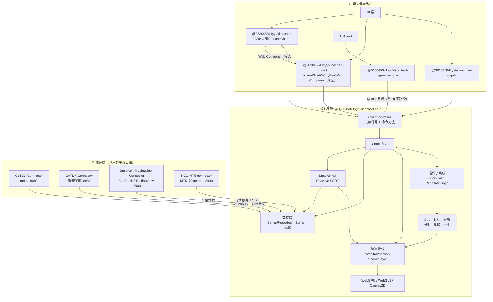

# 系统架构

> 更新日期：2026-09-12 | 适用范围：整个 monorepo（`packages/*`）与外部行情后端

本文描述 KLineChartQuant 的整体架构：包边界、核心引擎的分层、运行时数据流，
以及外部行情后端的接入方式。渲染主链路的细节以
[docs/rendering-pipeline.md](rendering-pipeline.md) 为事实来源，本文不与其重复。

## 1. 系统总览

KLineChartQuant 是一个 pnpm workspace monorepo。核心引擎（`packages/core`）不依赖任何
UI 框架，通过统一的 `ChartController` 对外暴露只读信号（ReadonlySignal）与命令方法；
Vue / React / Angular 绑定层只负责容器挂载、输入事件转发与响应式桥接。AI Agent 通过与 UI
相同的 `@Tool` 原语直接驱动图表，共享同一状态源，是项目的一等公民。

React 绑定（`@363045841yyt/klinechart-react`）的 `KLineChartWC` 直接封装由 Vue 包打包的
`<kline-chart>` Web Component（`@363045841yyt/klinechart/web-component`），因此 React 的
UI 接入路径是 Vue → Web Component → 控制器，而不是独立的原生 UI。

> 箭头约定：上层指向下层表示依赖 / 组合关系（如 `Ctl --> Chart`）；数据提供方指向引擎表示数据
> 流入消费方（如 `Go -->|行情数据| Data`）。行情后端是数据提供方，因此箭头从后端指向引擎数据层。

### 1.1 分层职责

| 层 | 负责 | 不负责 |
|---|---|---|
| 框架绑定（Framework bindings） | 容器挂载、输入事件转发、信号桥接、组件生命周期 | 业务状态与绘制细节 |
| `ChartController` | 统一命令面、只读信号投影、`@Tool` 原语 | 引擎内部实现 |
| `Chart` | 依赖组装、绘制调度、交互路由、主题/数据协调 | 单帧绘制细节 |
| `StateKernel` | 业务状态单一事实源（readonly signals + actions） | DOM 监听与绘制副作用 |
| 数据层 | 统一序列仓库、增量缓冲、拉取调度、数据源路由 | 图表状态 |
| 渲染管线 | 帧事务、几何封存、Scene/Layer 调度、后端降级 | 业务图元语义 |
| 插件子系统 | 插件注册、钩子、事件总线、渲染器插件管理 | 业务绘制 |
| 行情后端（外部） | 行情数据服务 | 前端逻辑 |

## 2. 包与依赖

| 包 | 路径 | 说明 | 发布名 |
|---|---|---|---|
| Core engine | `packages/core` | 无头图表引擎 + 控制器 | `@363045841yyt/klinechart-core` |
| Vue bindings | `packages/vue` | Vue 3 组件 + 组合式函数 | `@363045841yyt/klinechart` |
| React bindings | `packages/react` | React 绑定：`KLineChartWC` 经 Vue 打包的 `<kline-chart>` Web Component 接入 | `@363045841yyt/klinechart-react` |
| Angular bindings | `packages/angular` | Angular 绑定 | `@363045841yyt/klinechart-angular` |
| Agent runtime | `packages/agent-runtime` | 框架无关的 Agent 运行时（Pi 编排 + 宿主契约） | `@363045841yyt/klinechart-agent-runtime` |
| Desktop Electron | `packages/desktop-electron` | 本地桌面应用（不发布） | — |

依赖方向：各绑定包通过 `workspace:*` 依赖 core；core 不依赖任何框架。
构建顺序遵循 `pnpm build:packages`（core → vue）。

## 3. 核心引擎分层

核心引擎位于 `packages/core/src`，内部大致分四个模块组：
`controllers`（对外门面）、`engine`（图表组合与业务）、`rendering`（绘制基础设施）、
`data`（数据接入）。`foundation` 提供与业务无关的基建（响应式、插件、配置、工具）。

### 3.1 ChartController（对外门面）

`controllers/createChartController.ts` 提供 `createChartController(opts)` 工厂：

- 组装 DOM（挂载 canvas、滚动容器、左右轴、时间轴层），支持外部注入已存在的 DOM。
- 构造 `Chart` 实例，并把内核状态投影为一组 `ReadonlySignal`（viewport、data、
  indicators、theme、paneLayout、interactionState 等）。
- 暴露命令方法（`setData`、`setSymbols`、`zoomToLevel`、`addIndicator`、
  `setDrawingTool`、`handlePointerEvent` 等），全部委托给 `Chart` 门面。
- 通过 `@Tool` 装饰的领域方法注册 Agent 工具（`getRegisteredChartTools()`），与命令方法同源，
  无独立桥接层。

### 3.2 Chart（引擎门面）

`engine/chart.ts` 是引擎的组合根，负责装配：

- `ChartStateKernel`：业务状态单一事实源。
- `ChartViewportManager`：ResizeObserver 与滚动 DOM 适配。
- `ChartPaneLayout` / `PaneRenderer`：pane 布局与 Canvas DOM 生命周期。
- `ChartRenderer`：帧事务与逐 pane 绘制编排。
- `RendererHost`：后端创建、切换、降级、dispose。
- `PluginHost` 与交互控制器。

`Chart` 同时是数据、指标、标记、画图、分时、比较等业务能力的入口。

### 3.3 StateKernel（响应式状态内核）

`engine/state/stateKernel.ts` 定义响应式内核骨架，`ChartStateKernel` 聚合各子状态模块：

- 子状态包括 options、zoom、data、dataManager、comparison、indicator、subPane、
  marker、viewport、pane、settings、mode、drawing、interaction、renderer、
  systemTheme 等。
- 每个子状态模块对外只暴露 `readonly`（ReadonlySignal 包）+ 语义化 `actions`；
  所有写入都必须经过 action，派生状态放在 `computed()`，DOM 副作用放在 `effect()`。
- 多字段写入通过 `batch()` 合并为一次通知周期，保证消费者读到一致快照。
- 偏好主题在 `settings.theme`，生效主题由偏好 + `systemTheme` 在 `computed()` 派生，
  对外暴露为扁平 `signals.theme`。

设计原则：单一事实源、自动派生、读写分离、effect 隔离、批处理原子更新。

### 3.4 数据层

`data/` 负责行情数据的统一存取与接入：

- `buffer/seriesRepository.ts`：统一序列仓库，按 `SeriesSelection`（K 线 / 分时）
  管理 `KLineBuffer`，对比序列与主序列共用同一仓库。
- `buffer/dataBuffer.ts`：增量数据缓冲，支持前向补页（`ensureRange`）、
  左缘扩窗与加载状态。
- `buffer/fetchScheduler.ts`：拉取调度，合并可见区缺口检查。
- `provider/`：数据源注册表与路由（gotdx、baostock、tradingview、mock），
  通过 `VITE_GOTDX_API_BASE_URL` 等配置连接外部后端。
- `depth/binance.ts`：币安 L2 订单簿 + SSE 深度流（:8081）。

### 3.5 渲染管线

`rendering/` 与 `engine/render/` 实现统一绘制路径。事实来源见
[docs/rendering-pipeline.md](rendering-pipeline.md)，此处仅列要点：

- `Chart.scheduleDraw(level)` → `ChartRenderer` + `FrameTransaction` 合并高频请求，
  非重入地推进帧快照。
- `prepareFrameData` 从 viewport 派生可见范围与 K 线几何，`sealFrameGeometry` 在绘制前
  封存本帧几何，交互命中与屏幕图形同代。
- `Scene` / `Layer` 按 paneRole / role / z 排序分发 paint；Layer role 分为
  background、primary、indicator、component、drawing、overlay。
- 业务层只依赖统一 `Renderer` 契约（`drawInstances` / `drawLines`），由
  `RendererHost` 决定实际后端：WebGPU → WebGL2 → Canvas2D 自动降级，
  GPU 返回 `false` 时业务层必须完整执行 Canvas2D fallback。
- DPR 以物理像素执行、逻辑像素输入，DPR 的唯一来源是 viewport state。

### 3.6 插件子系统

`foundation/plugin/` 提供框架无关的插件基建：

- `PluginHost`：插件注册、服务解析、生命周期管理。
- `HookSystem` / `EventBus` / `ConfigManager` / `StateStore`：钩子、事件、配置与状态。
- `RendererPluginManager`：负责动态指标渲染插件的注册、配置与启停；实际绘制经
  `createLayerFromPlugin()` 桥接为 Scene Layer，由主 paint 驱动。

指标、标记、画图等业务能力以 Layer / RendererPlugin 形态接入渲染管线。

## 4. 运行时数据流

### 4.1 数据加载

1. 绑定层调用 `controller.setSymbols(spec)` 或注入 `customData`。
2. `Chart` 通过 `ChartDataManager` 在 `SeriesRepository` 中定位 / 创建对应 Buffer。
3. 图表与 Agent 共用图表实例级 `MarketDataCache`；它根据 latest 或时间范围处理缓存覆盖、
   Provider cursor 分页、重试与请求去重。
4. `MarketDataCache` 将结果写入图表 Buffer 快照；Buffer 数据变更经订阅回调更新 StateKernel 的 data 信号，并触发
   `scheduleDraw()`。

### 4.2 渲染一帧

1. 输入（缩放、滚动、数据变更）调用 `scheduleDraw(level)`。
2. `FrameTransaction` 封存输入 → `prepareFrameData` 生成几何快照 → `sealFrameGeometry`。
3. 按 pane 执行 `Scene.paintPane`，Layer 通过统一 `Renderer` 绘制；
   GPU 路径失败时业务层回退 Canvas2D。
4. `Renderer.endFrame()` 收口（WebGPU 每帧单次 `queue.submit`），随后绘制时间轴层。

### 4.3 交互

指针 / 滚轮 / 触摸事件由绑定层转发给 `Chart.handlePointerEvent` /
`handleWheelEvent` / `handlePinchZoom`，交互控制器更新内核状态并触发 Overlay
级别的增量重绘（十字线不重画静态主层）。

### 4.4 Agent 原生

1. Core 以 `@Tool` 装饰领域方法，`getRegisteredChartTools()` 暴露统一工具契约
   （参数 schema、safety 等级与执行器）。
2. `@363045841yyt/klinechart-agent-runtime` 在应用内（浏览器 / Electron）编排 Agent，
   直接调用这些原语，与 UI 走同一条链路。
3. Agent 与用户共享 StateKernel 状态，无桥接层、无状态副本。

## 5. 外部数据源

行情后端与仓库同级目录，不在 monorepo 内：

| 后端 | 路径 | 端口 | 作用 |
|---|---|---|---|
| GoTDX-Connector | 同级 `GoTDX-Connector/` | `8080` | gotdx 通达信：A 股 / 期货 / MAC K 线 |
| GoTDX-Connector | 同级 `GoTDX-Connector/` | `8081` | 币安 L2 订单簿 + SSE 深度 |
| Baostock-Tradingview-Connector | 同级 `Baostock-Tradingview-Connector/` | `8000` | BaoStock A 股 + TradingView 全球品种 |
| KCQ-MT5-connector | 同级 `KCQ-MT5-connector/` | `8090` | MT5（Exness）本地终端：外汇 / 金属 / 加密 CFD + SSE 实时 K 线（Windows） |

前端对接代码：`packages/core/src/data/provider/sources/gotdx.ts`、
`packages/core/src/data/provider/sources/mt5.ts`、`packages/core/src/data/live/mt5BarsLive.ts`、
`packages/core/src/data/depth/binance.ts`。Vite 开发代理 `/api/public` → `:8080`、
`/api/stock` → `:8000`。`pnpm setup:backends` 可幂等克隆上述后端，`pnpm dev -c all` 一键启动
（`mt5` 依赖 Windows + 本机 MT5 终端，不纳入 `all`，需显式 `pnpm connector mt5` / `pnpm dev -c mt5`）。

## 6. 关键文件索引

**包入口**

- `packages/core/src/index.ts`
- `packages/vue/src/index.ts`
- `packages/react/src/index.ts`、`packages/angular/src/index.ts`

**控制器与门面**

- `packages/core/src/controllers/createChartController.ts`
- `packages/core/src/engine/chart.ts`

**状态内核**

- `packages/core/src/engine/state/stateKernel.ts`
- `packages/core/src/engine/state/chartStateKernel.ts`
- `packages/core/src/engine/state/viewportState.ts`

**数据层**

- `packages/core/src/data/buffer/seriesRepository.ts`
- `packages/core/src/data/buffer/dataBuffer.ts`
- `packages/core/src/data/buffer/fetchScheduler.ts`
- `packages/core/src/data/provider/registry.ts`

**渲染**

- `packages/core/src/rendering/render/Renderer.ts`
- `packages/core/src/rendering/render/rendererHost.ts`
- `packages/core/src/rendering/scene/createScene.ts`
- `packages/core/src/foundation/reactivity/frameTransaction.ts`
- `packages/core/src/engine/render/chartRenderer.ts`

**插件与响应式**

- `packages/core/src/foundation/plugin/PluginHost.ts`
- `packages/core/src/foundation/reactivity/signal.ts`

## 7. 维护要求

- 本文与 `docs/rendering-pipeline.md` 分工：本文讲「整体架构」，渲染文档讲「绘制实现」。
  渲染行为变化优先更新渲染文档；包边界、分层或数据流变化更新本文。
- 新增包时同步更新第 2 节包表与 README `_packages` 片段。
- 新增外部数据源时同步更新第 5 节与 README `_data-sources` 片段。
- 分层职责表（1.1）是边界约定：业务 Layer 不应直接依赖具体 GPU API，
  业务状态只能通过 StateKernel action 写入。
