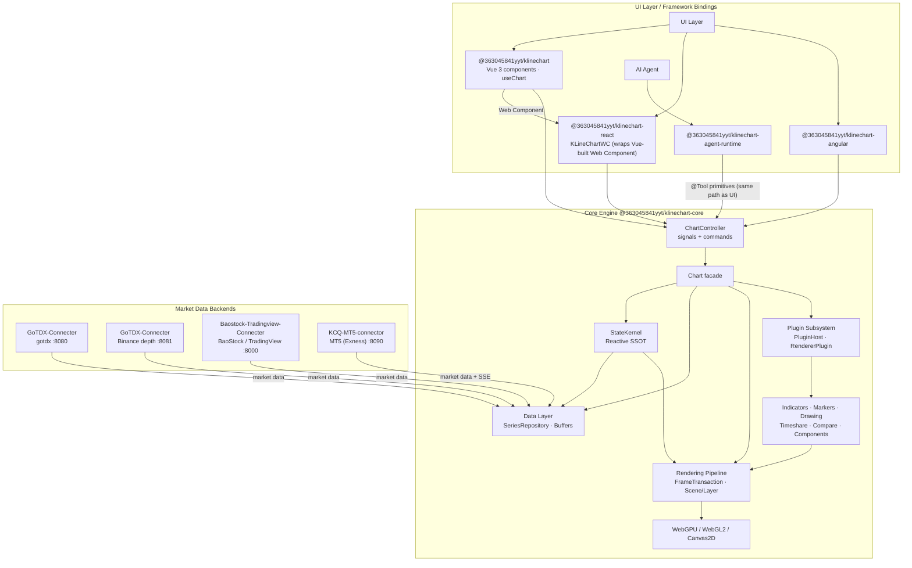

## 📐 System Architecture

KLineChartQuant is a pnpm monorepo. The framework-agnostic core engine exposes a unified
`ChartController` (readonly signals + commands); Vue / React / Angular bindings only handle
mounting, event forwarding, and reactivity bridging. The AI Agent drives the chart through the
same `@Tool` primitives as the UI, sharing one state source instead of a bridge.

- **Core engine** — headless chart engine + `ChartController`; depends on no UI framework.
- **StateKernel** — single source of truth: readonly signals for reads, actions for writes,
  `computed()` for derivation, `effect()` for DOM side effects.
- **Rendering** — submit primitives once, render via WebGPU / WebGL2 / Canvas2D with
  automatic fallback (WebGPU → WebGL → Canvas2D).
- **Data layer** — unified `SeriesRepository` + incremental buffers + fetch scheduler;
  multi-source aggregation (gotdx / BaoStock / TradingView / MT5 / mock) and Binance depth.
- **Plugin subsystem** — PluginHost / HookSystem / EventBus / RendererPluginManager;
  indicators, markers and drawing tools plug in as Scene Layers.
- **React via Web Component** — `@363045841yyt/klinechart-react`'s `KLineChartWC` renders the
  `<kline-chart>` Custom Element bundled from the Vue package (`@363045841yyt/klinechart/web-component`).
- **Agent Native** — `@363045841yyt/klinechart-agent-runtime` orchestrates the Agent, which
  invokes the core's `@Tool`-registered primitives—the same entry points the UI uses.

See [docs/architecture.md]({{root}}docs/architecture.md) for the full architecture document.
