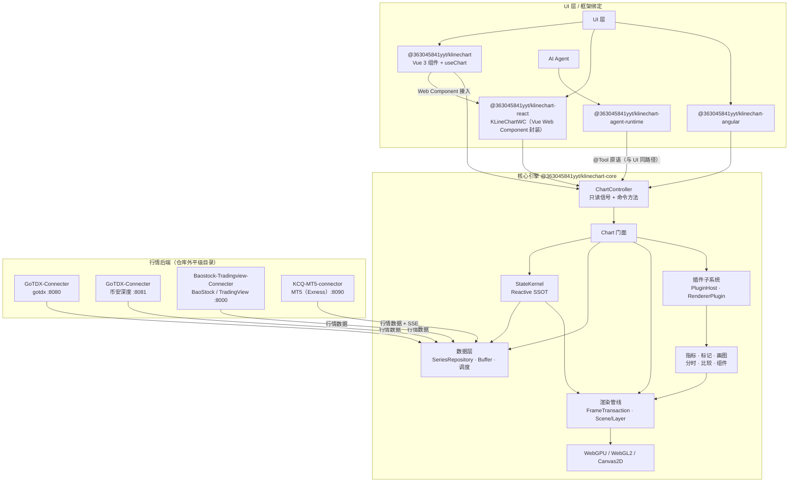

## 📐 系统架构

KLineChartQuant 是一个 pnpm monorepo。核心引擎不依赖任何 UI 框架，通过统一的
`ChartController`（只读信号 + 命令方法）对外暴露能力；Vue / React / Angular 绑定层只负责
挂载、事件转发与响应式桥接。AI Agent 通过与 UI 相同的 `@Tool` 原语直接驱动图表，
共享同一状态源，而非桥接层。

- **核心引擎** — 无头图表引擎 + `ChartController`，不依赖任何 UI 框架。
- **StateKernel** — 状态单一事实源：只读信号读、action 写、`computed()` 派生、
  `effect()` 副作用。
- **渲染** — 图元一次提交，WebGPU / WebGL2 / Canvas2D 三后端渲染，自动降级
  （WebGPU → WebGL → Canvas2D）。
- **数据层** — 统一 `SeriesRepository` + 增量缓冲 + 拉取调度；多数据源聚合
  （gotdx / BaoStock / TradingView / MT5 / mock）与币安深度。
- **插件子系统** — PluginHost / HookSystem / EventBus / RendererPluginManager；
  指标、标记、画图以 Scene Layer 形式接入。
- **React 经 Web Component 接入** — `@363045841yyt/klinechart-react` 的 `KLineChartWC` 渲染由
  Vue 包打包的 `<kline-chart>` 自定义元素（`@363045841yyt/klinechart/web-component`）。
- **Agent 原生** — `@363045841yyt/klinechart-agent-runtime` 编排 Agent，直接调用核心
  `@Tool` 注册的原语——与 UI 使用同一入口。

完整架构文档见 [docs/architecture.md]({{root}}docs/architecture.md)。
